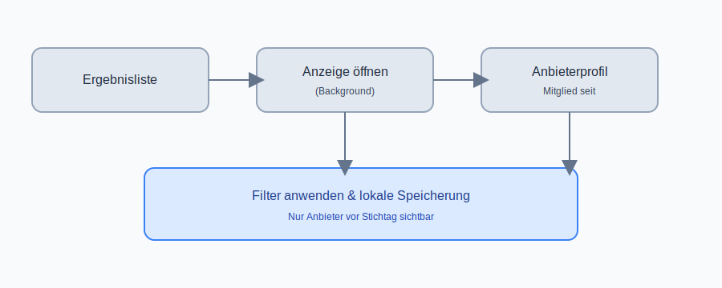
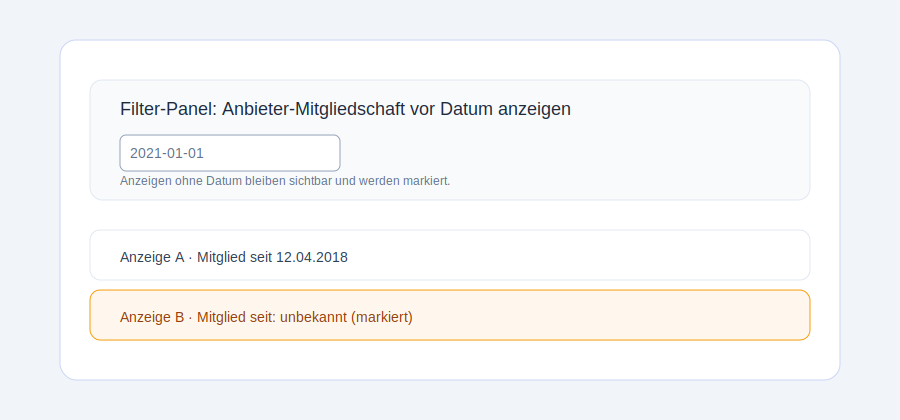

# Kleinanzeigen-Filter

Firefox-Addon zum Filtern von Kleinanzeigen-Angeboten nach dem Mitglied-seit-Datum der Anbieter.

## Funktionsumfang

- Fügt auf Ergebnislisten ein Filter-Panel hinzu, mit dem ein Stichtag gewählt werden kann.
- Öffnet Anzeigen im Hintergrund, ruft das Profil des Anbieters auf und ermittelt das Mitglied-seit-Datum.
- Blendet automatisch Anbieter aus, die nach dem Stichtag beigetreten sind.
- Markiert Anzeigen ohne ermittelbares Datum, blendet sie aber nicht automatisch aus.
- Speichert den Filterstatus lokal und wendet ihn beim nächsten Besuch automatisch an.

## Installation (Firefox)

1. Repository klonen oder als ZIP herunterladen.
2. In Firefox `about:debugging#/runtime/this-firefox` öffnen.
3. **"Temporäres Add-on laden"** wählen.
4. Die Datei `manifest.json` aus diesem Projekt auswählen.
5. Eine Suche auf `https://www.kleinanzeigen.de/` ausführen – das Panel erscheint automatisch.

> Hinweis: Für eine dauerhafte Installation muss das Add-on signiert sein. Für die Entwicklung reicht der temporäre Modus.

## Bedienung

1. Auf einer Ergebnisliste den gewünschten Stichtag im Panel auswählen.
2. Das Add-on lädt Anzeigen und Anbieterprofile im Hintergrund.
3. Anbieter, die nach dem Stichtag beigetreten sind, werden ausgeblendet.
4. Anzeigen ohne Datum bleiben sichtbar, sind aber markiert.

## Produktbeispiel

## Entwicklung

Die wichtigsten Dateien:

- `manifest.json` – Firefox-Manifest inkl. Content- und Background-Skripte.
- `content.js` / `content.css` – UI und Filterlogik auf Ergebnislisten.
- `background.js` – Hintergrund-Logik zum Abrufen der Mitglied-seit-Daten.
